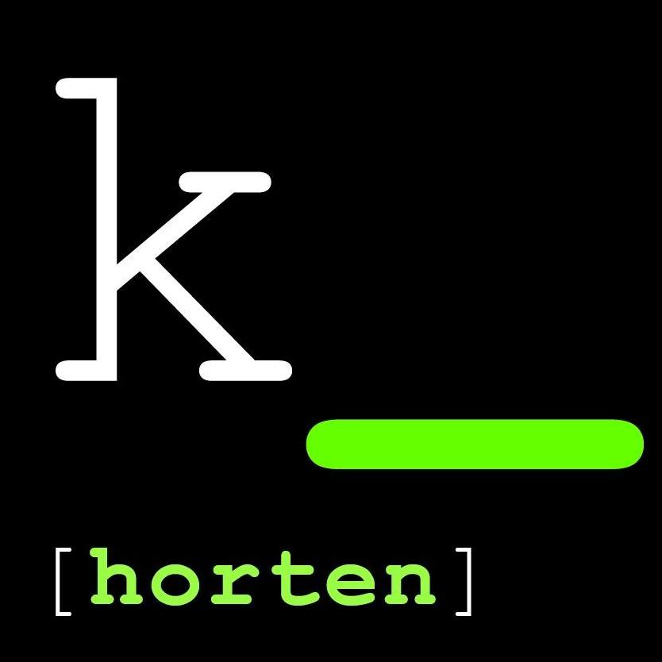

Vestfold Digitale Ungdom arrangerer Kodeklubben Tønsberg og Kodeklubben Horten som lavterskeltilbud, uten krav om påmelding eller medlemsskap i Vestfold Digitale Ungdom. Det er bare å møte opp på klubbdagene våre. Har man egen PC, kan man gjerne ta den med, ellers har vi massevis av bærbare PCer som kan lånes.

Kodeklubben Horten er siden januar 2022 satt lit på vent, så vi anbefaler heller deltagelse på Kodeklubben Tønsberg.

Kodeklubben Tønsberg arrangeres annenhver lørdag, i kjelleren på Tønsberg og Færder bibliotek. 

Mens vi jobber med de nye nettsidene våre så finner du den mest oppdaterte informasjonen om Kodeklubben på Facebook-sidene våre:

[{: .logo}](https://nb-no.facebook.com/KodeklubbenTonsberg/)
[{: .logo}](https://nb-no.facebook.com/KodeklubbenHorten/)

== Kontakt oss ==

Prosjektleder for Kodeklubben er Lars Åge Kamfjord
Epost: lars.age (at) kamfjord (dot) org
Mobil: 99 59 43 43
